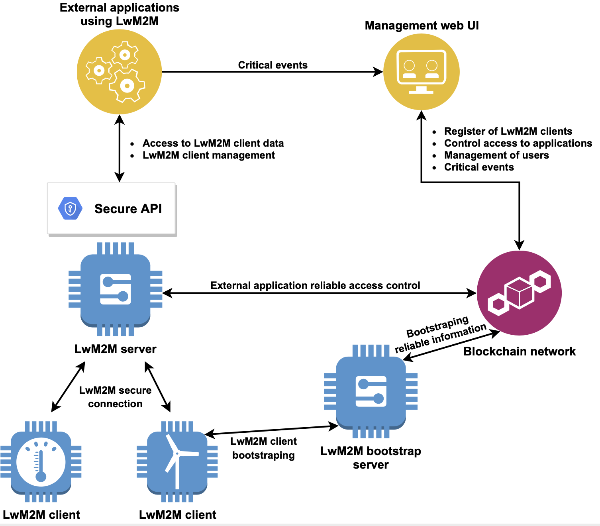

# LwM2M-blockchain
In this repository, the [LWM2M](https://omaspecworks.org/what-is-oma-specworks/iot/lightweight-m2m-lwm2m/) protocol is integrated with blockchain to improve reliability and auditability. This integration also provides a secure ledger to store critical information like anomalies. The Java implementation of LWM2M, [Leshan](https://github.com/eclipse/leshan), and Ethereum testnet [Ropsten](https://ropsten.etherscan.io/) have been be used for this purpose.

This repository is divided in six main folders:
* **anomalyDetectionApp** --> Demo application that requests data from LwM2M clients and checks if the received information is an anomaly or not.
* **docs** --> Project documentation.
* **evaluation** --> Java project to test system interaction with the blockchain network.
* **leshan** --> Java Implementation of LwM2M protocol modified to interact with the Ropsten network.
* **mainApp** --> Frontend and backend of the Web management UI Application.
* **smartContracts** --> Smart Contracts are stored here.

## License
MIT
