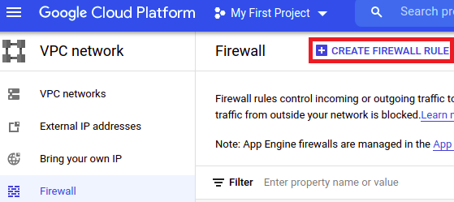
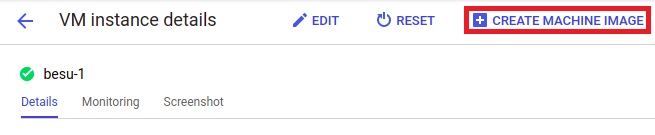
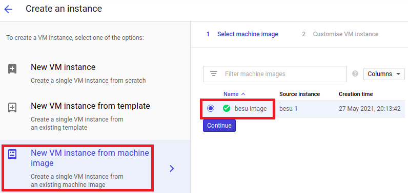

# Create a Besu network on GCP
This guide explains how to create a Besu network using Google Cloud Platform

### Preliminary remarks
First of all, it is important to note that this network creation can be done in two different ways:
- Using `gcloud` CLI
- Through https://console.cloud.google.com/ UI

No matter what approach you use. In both cases you will be working with **Compute Engine** service.

### Installing `gcloud` CLI
1. Add the Cloud SDK distribution URI as a package source:
```bash
echo "deb [signed-by=/usr/share/keyrings/cloud.google.gpg] https://packages.cloud.google.com/apt cloud-sdk main" | sudo tee -a /etc/apt/sources.list.d/google-cloud-sdk.list
```

2. Import the Google Cloud public key:
```bash
curl https://packages.cloud.google.com/apt/doc/apt-key.gpg | sudo apt-key --keyring /usr/share/keyrings/cloud.google.gpg add -
```

3. Update and install the Cloud SDK
```bash
sudo apt-get update && sudo apt-get install google-cloud-sdk
```

4. Run `gcloud init` to get started  
    1. You will be asked to log in to continue. A new window of your default browser will be prompted to perform Google Cloud authentication.
    2. Then, pick a cloud project (or create a new one)to use.
    3. Finally, select a default Compute Region and Zone. As of May 2021, there is no region in Spain. However, a region will be created in Madrid in the next few years. In the meantime, I do recommend to use **europe-west1-b** (located in Belgium).

### Adding a firewall rule for Besu API
In order to communicate with Besu JSON-RPC API it is necessary to expose API port. To do that, Google Cloud provides firewall rules.
Go to VPC network > firewall and click **CREATE FIREWALL RULE** button.

Now, a new screen will be shown, where you have to indicate firewall rule information:
- Name: besu-json-rpc-api
- Logs: Off
- Network: default
- Priority: 1000
- Direction of traffic: Ingress
- Action on match: Allow
- Targets: Specified target tags
- Target tags: besu-api
- Source filter: IP ranges
- Source IP ranges: 0.0.0.0/0
- Protocols and ports: Specified protocols and ports
    - tcp: 8545

Equivalent `gcloud` command:
```bash
gcloud compute firewall-rules create besu-json-rpc-api \
    --direction=INGRESS --priority=1000 --network=default \
    --action=ALLOW --rules=tcp:8545 --source-ranges=0.0.0.0/0 \
    --target-tags=besu-api
```

### Creating the first virtual machine
Go to Compute Engine service and click **CREATE INSTANCE** button.

Now, a new screen will be shown, where you have to indicate the instance requirements:
- Name: besu-1
- Region/Zone: europe-west1/europe-west1-b
- Machine configuration:
    - General-purpose
    - Series: E2
    - Machine type: e2-standard-2 (2 vCPU, 8 GB memory)
- Boot disk:
    - Image: Ubuntu 20.04 LTS
    - Boot disk type: Balanced persistent disk
    - Size: 20 GB
- Firewall:
    - Allow HTTP traffic
    - Allow HTTPS traffic
- Networking
    - Network tags: "besu-api"

Equivalent `gcloud` commands:
```bash
# HTTPS rule
gcloud compute firewall-rules create default-allow-https \
    --direction=INGRESS --priority=1000 --network=default \
    --action=ALLOW --rules=tcp:443 --source-ranges=0.0.0.0/0 \
    --target-tags=https-server
# Virtual machine
gcloud compute instances create besu-1 \
    --machine-type=e2-standard-2 \
    --subnet=default \
    --tags=http-server,https-server,besu-api \
    --image=ubuntu-2004-focal-v20210510 \
    --image-project=ubuntu-os-cloud \
    --boot-disk-size=20GB \
    --boot-disk-type=pd-balanced \
    --boot-disk-device-name=besu-1
```

### Connecting to the newly created instance and preparing the network
Through Google Cloud console UI:

Or via command: `gcloud beta compute ssh "besu-1"`

Once you are connected to the instance, install Java and Hyperledger Besu:
```bash
sudo apt update
# Install java
sudo apt install default-jdk
java --version
# Install besu
export BESU_VERSION=21.1.1 # Use the version that best suits your needs
wget https://bintray.com/api/ui/download/hyperledger-org/besu-repo/besu-$BESU_VERSION.tar.gz
tar -xvf ./besu-$BESU_VERSION.tar.gz && cd besu-$BESU_VERSION
./bin/besu --version
# Include besu path to $PATH in order to make besu global
sudo nano /etc/environment
source /etc/environment
besu --version
```

Create folder to store blockchain data and genesis file (which is [ethashGenesis.json](./consensus_protocols/genesis_files/ethashGenesis.json))
```bash
mkdir besu_data
nano ethashGenesis.json
```

### Creating a machine image
Until this point, everything we have installed or created is common to all nodes in the network. That is the reason why using a machine image comes in handy. A machine image allows to store all the configuration, metadata, permissions and data from one disk for a VM instance running on Compute Engine.

To create a machine image, go to **besu-1** details and press **CREATE MACHINE IMAGE** button:


Then, fill the fields with the content shown below:


### Creating other VM from machine image
Go to Compute Engine service and click **CREATE INSTANCE** button. This time choose _'New VM instance from machine image'_ and select **besu-image**. Finally, complete the process without changes on VM configuration.


Equivalent `gcloud` commands:
```bash
# besu-2
gcloud beta compute instances create besu-2 \
--source-machine-image besu-image
# besu-3
gcloud beta compute instances create besu-3 \
--source-machine-image besu-image
```

### Running Besu nodes
In order to ease Besu execution, create a script named `start.sh` on each machine:
- besu-1
```bash
#!/bin/bash

besu --data-path=besu_data --genesis-file=ethashGenesis.json \
     --miner-enabled --miner-coinbase fe3b557e8fb62b89f4916b721be55ceb828dbd73 \
     --rpc-http-enabled --host-allowlist="*" --rpc-http-cors-origins="all" \
     --rpc-http-host=0.0.0.0
```

- besu-2 & besu-3
```bash
#!/bin/bash

N1_ENODE="<node-1 enode URL>"

besu --data-path=besu_data --genesis-file=ethashGenesis.json \
     --bootnodes=$N1_ENODE
```

To grant execution permission: `chmod +x start.sh`

### Checking network correct funcionamiento
```bash
curl -X POST --data '{"jsonrpc":"2.0","method":"net_peerCount","params":[],"id":1}' \
    <besu-1-ip-address>:8545
```

### Useful commands
- Get default project
```bash
$ gcloud config list --format='text(core.project)'
> project: <your-default-project>
```

- Get default Compute Engine zone
```bash
$ gcloud config list --format='text(compute.zone)'
> zone: europe-west1-b
```

- Get firewall rules
```bash
$ gcloud compute firewall-rules list
```